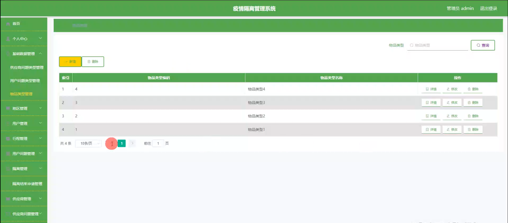

# 基于springboot+vue的疫情隔离管理系统

---
### 👉作者QQ ：1556708905 微信：zheng0123Long (支持定制修改、部署调试、定制毕设)

### 👉接网站建设、小程序、H5、APP、各种系统等

---

#### 介绍

在疫情防控的大背景下，为了实现对疫情隔离工作的高效、精准管理，我们开发了这套基于 Spring Boot + Vue 的疫情隔离管理系统。该系统通过信息化手段，整合各方资源，为疫情隔离工作提供有力的技术支持，确保隔离措施的有效实施和人员的安全管理。

#### 技术栈

后端技术栈：Springboot+Mysql+Maven

前端技术栈：Vue+Html+Css+Javascript+ElementUI

开发工具：Idea+Vscode+Navicate

#### 系统功能介绍

（一）管理端  
个人中心：管理端用户可以在个人中心查看和修改自己的个人信息，以及系统操作记录和通知。  
基础数据管理：维护系统所需的基础数据，如隔离类型、隔离政策法规、隔离点信息等。  
地区管理：对不同地区的疫情风险等级进行划分和管理，以便根据地区情况制定相应的隔离策略。  
用户管理：对隔离人员的基本信息进行管理，包括个人身份信息、联系方式、健康状况等。  
行程管理：记录隔离人员的行程轨迹，便于追踪和排查潜在的感染风险。  
用户问题管理：及时处理隔离人员提出的各类问题和需求，提供必要的帮助和支持。  
隔离管理：安排隔离人员的隔离地点、隔离时间、隔离方式等，确保隔离工作的有序进行。  
隔离结束申请管理：审核隔离人员的结束隔离申请，确认其是否满足解除隔离的条件。  
供应商管理：对提供隔离物资和服务的供应商进行管理，包括供应商信息、资质审核等。  
供应商问题管理：处理供应商在物资供应和服务过程中遇到的问题。  
物品管理：对隔离所需的各类物品进行管理，包括物资的种类、数量、库存等。  
物品申请管理：审批隔离点和隔离人员的物品申请，保障物资的合理分配和供应。  

（二）供应商端  
个人中心：供应商可以在个人中心查看和修改自己的企业信息和联系方式。  
供应商问题管理：查看和回复管理端提出的问题，及时解决合作过程中的沟通障碍。  
物品管理：对自己供应的物品进行库存管理、质量监控和信息更新。  
物品申请管理：处理来自隔离点和管理端的物品申请，安排物资配送。  

（三）用户端  
个人中心：隔离人员可以在个人中心查看自己的隔离信息和个人资料。  
隔离管理：了解自己的隔离安排和要求，如隔离地点、时间、注意事项等。  
隔离结束申请管理：在满足条件时提交隔离结束申请，等待审核。  
物品管理：查看隔离期间可申请的物品清单和自己的物品申请状态。  
物品申请管理：根据自身需求提交物品申请。  
行程管理：如实上报自己的行程信息，方便系统进行追踪和管理。  
用户问题管理：向管理端提出自己在隔离期间遇到的问题和需求。  

#### 系统作用

提高疫情隔离管理效率  
自动化处理大量的隔离数据和流程，减少人工操作的繁琐和错误，提高工作效率。  
保障隔离工作的精准性  
通过对人员行程、隔离安排等的精细管理，有效控制疫情传播风险。  
优化物资供应和分配  
实现对隔离所需物品的准确管理和合理分配，确保物资供应的及时性和充足性。  
增强信息沟通和服务质量  
为隔离人员、供应商和管理端提供便捷的沟通渠道，及时解决问题，提高服务满意度。  
助力疫情防控决策  
系统提供的数据分析和报表功能，为疫情防控决策提供有力支持，制定更科学的防控策略。  

#### 系统功能截图

代码结构

数据库表

登录

基础数据管理

地区管理

用户管理

行程管理

用户问题管理

隔离管理

物品申请管理

供应商端供应商问题管理

物品管理

物品申请管理

用户端隔离结束申请管理

行程管理

#### 总结

基于 Spring Boot + Vue 的疫情隔离管理系统，通过明确管理端、供应商端和用户端的功能分工，实现了疫情隔离工作的全流程信息化管理。该系统在疫情防控中发挥了重要作用，有助于提高隔离管理的效率和质量，保障公众的健康和安全。

#### 使用说明

创建数据库，执行数据库脚本 修改jdbc数据库连接参数 下载安装maven依赖jar 启动idea中的springboot项目

后台登录页面
http://localhost:8080/yiqinggeliguanli/admin/dist/index.html

管理员				账户:admin 		密码：admin

供应商				账户:a3 		密码：123456

用户				账户:a1 		密码：123456